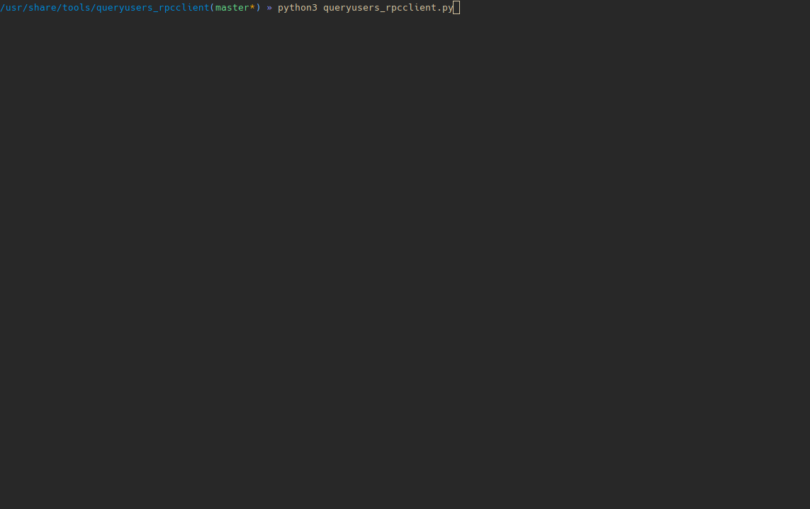

# queryusers_rpcclient

Advanced enumeration rpcclient.

This tool use the 'rpcclient' to enumerate informations about users found.

- You can run this tool with the ip address or the fqdn name with the option (- i).

- You can log all the output in one file with the option (-o).

